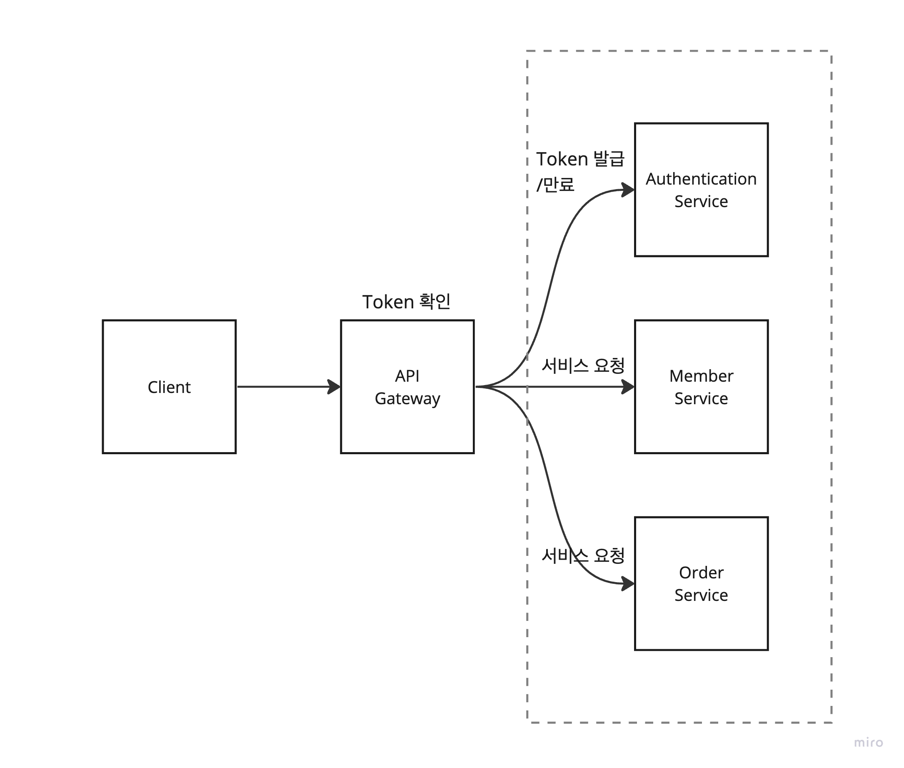
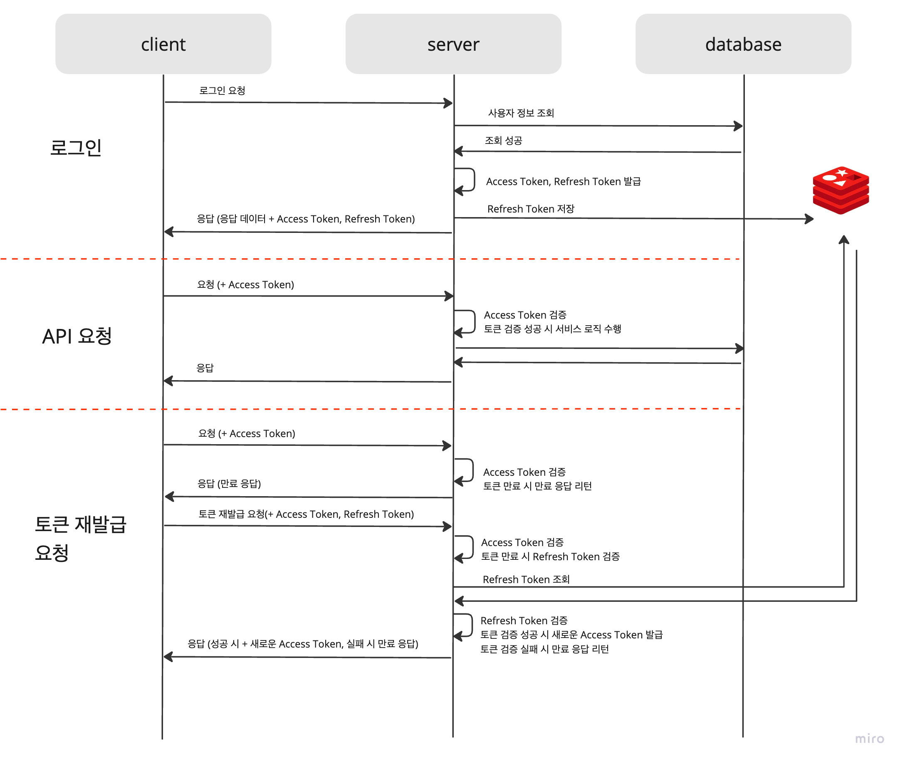

# Authenticate Server

MSA 구조의 인증 서버 구축 (Authorization & Authentication Sever in MicroService Architecture)

1. Security filter 와 authority/role 을 사용하기 위해 Spring Security 를,
2. 무상태성을 유지하는 어플리케이션 개발을 위해 JWT 를,
3. 데이터에 빠르게 접근 가능하여 병목 현상을 방지하고, 데이터의 유효기간을 지정할 수 있는 in-memory 인 redis 를 사용하였다.

## System Architecture



API Gateway를 활용한 공통 인증을 전제로, 인증 서버를 구축하였다.

1. 사용자는 JWT를 첨부하여 API Gateway를 통해 서비스에게 명령을 요청한다.
2. API Gateway는 요청된 명령을 수신하여 JWT 인증 로직을 수행한다.
3. 인증된 사용자 정보를 요청에 추가로 첨부하여 서비스에게 전달한다.
4. 서비스는 API Gateway가 첨부한 사용자 인증 정보를 기반으로 요청을 처리한다.

## Flow



1. 사용자 로그인 요청이 들어오면, 서버는 사용자의 인증 정보를 검증한다.
2. 유효한 인증 정보인 경우

- 2-1. 서버는 JWT Access Token과 Refresh Token을 생성하고
- 2-2. 생성된 Refresh Token을 redis 저장소에 저장한다.

3. 생성된 Access Token, Refresh Token을 사용자에게 전달하고, 클라이언트는 이를 메모리 등에 저장한다.
4. 클라이언트가 보유한 Access Token이 만료된 경우, 클라이언트는 서버에 Access Token, Refresh Token을 사용하여 새로운 Access Token을
   요청한다.

- 4-1. 서버는 클라이언트로부터 받은 Access Token 의 조작 여부를 다시 확인한 뒤
- 4-2. Refresh Token을 저장소에 저장된 값과 비교하여 일치하는지 확인한다
    - 4-2-1. 유효한 경우에만 새로운 Access Token을 발급한다.
    - 4-2-2. Refresh Token이 유효하지 않다면(만료) 클라이언트는 사용자를 로그아웃 처리한다.

5. 클라이언트는 발급받은 새로운 Access Token을 사용하여 API 를 요청한다.
6. 사용자가 로그아웃하거나 Refresh Token이 만료된 경우, 저장소에서 해당 Refresh Token을 삭제하여 더 이상 사용되지 않도록 처리한다.

## API Specifications

1. 로그인 (Sign-In)

- Method: POST
- URI: /api/v1/auth/login
- Request(Request Body)

```json
{
  "email": "admin@shong91.test.com",
  "password": "admin"
}
```

- Response

```json
{
  "timestmap": "2023-08-13T20:09:40.34976",
  "code": 200,
  "codeName": "OK",
  "desc": "OK",
  "data": {
    "user": {
      "id": 1,
      "email": "admin@shong91.test.com",
      "username": "테스트 유저"
    },
    "token": {
      "accessToken": "<access-token>",
      "refreshToken": "<refresh-token>"
    }
  }
}
```

2. 토큰 재발급 (reissue access token)

- Method: POST
- URI: /api/v1/auth/reissue-token
- Request: (Http Headers)

```shell
Authorization: Bearer <access-token>
Refresh-Token: <refresh-token>
```

- Response

```json
{
  "timestmap": "2023-08-13T18:08:48.736688",
  "code": 200,
  "codeName": "OK",
  "desc": "OK",
  "data": {
    "accessToken": "<reissue-token>",
    "refreshToken": "<refresh-token>"
  }
}
```

3. 로그아웃 (Sign-Out)

- Method: POST
- URI: /api/v1/logout
- Request

```shell
Authorization: Bearer <access-token>
```

- Response

```json
{
  "timestmap": "2023-08-13T20:09:55.307405",
  "code": 200,
  "codeName": "OK",
  "desc": "OK",
  "data": 1
}
```
